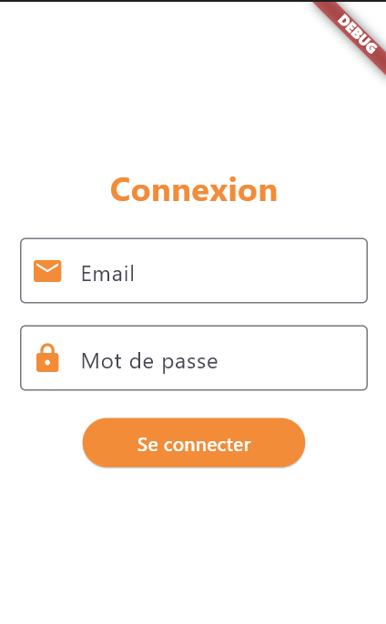
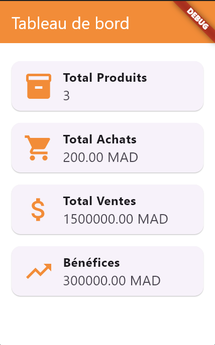

# stock_app

Application mobile
Réalisée avec Flutter, cette application permet d’accéder facilement aux statistiques et aux données importantes directement depuis un smartphone. Elle se connecte à l’application web pour récupérer les informations en temps réel, offrant ainsi une mobilité et une flexibilité supplémentaires aux utilisateurs.
### Page de Connexion

### Tableau de Bord
Cet écran représente le tableau de bord de l’application mobile Flutter, réservé uniquement à l’administrateur après connexion. Il affiche les statistiques essentielles de gestion :
•	Total Produits : Nombre de produits enregistrés dans le stock.
•	Total Achats : Montant global des achats effectués.
•	Total Ventes : Chiffre d’affaires total généré.
•	Bénéfices : Résultat net calculé automatiquement.
Ces données sont récupérées en temps réel via une API connectée à l’application web Laravel. Cela permet à l’administrateur de consulter à distance l’état du stock et des ventes sans avoir besoin d’accéder à l’application desktop.
Le design a été pensé pour être clair, rapide à lire, et adapté à un usage mobile, avec des icônes représentatives et une mise en page fluide.
